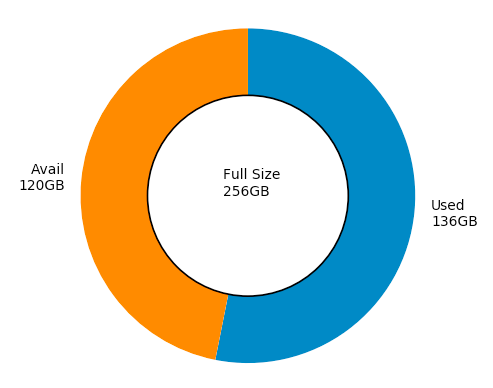

# Storageを円グラフで可視化
## 環境
MacOS High Sierra
Python3.6

## 実行方法
ターミナルで`graph.py`を実行(`python graph.py`)
## 機能
Macでのストレージの使用割合を円グラフにして表示

## 実装済み機能

1. 空き容量と使用済み容量の円グラフ

## 実装予定の機能
1. System,App,iTunes,Document,others,freeの円グラフ
2. 選択したディレクトリ内の長期間使用されていないファイルの表示
3. etc...
